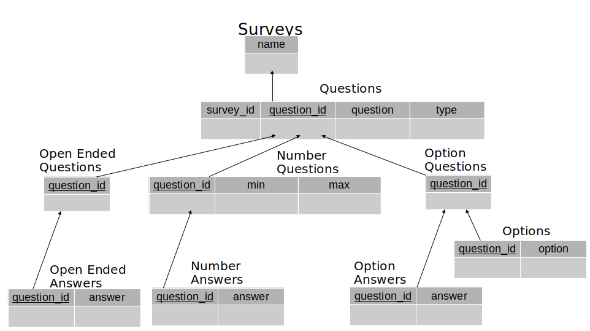
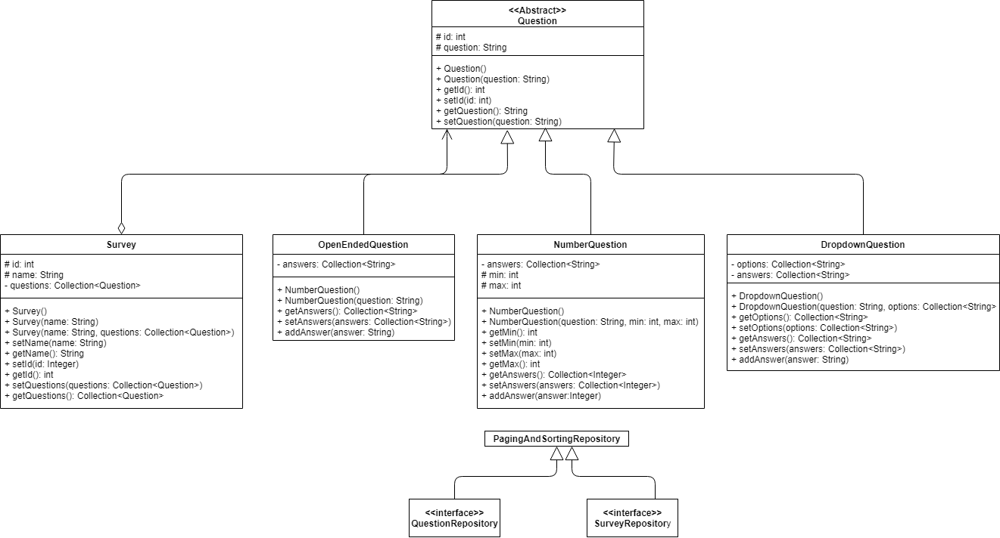

# SYSC4806_Project 
The SYSC4806_Project For Group 2

Question Quail (Mini-SurveyMonkey)
==============

# Background
This project is a mini survey monkey application. It allows users to 
create and register surveys, and collect results from the surveys.

A surveyor can create a survey with a list of Questions. Questions can be open-ended (text), asking for a number within a range, or asking to choose among many options.  Users fill out a survey that is a form generated based on the type of questions in the survey. Surveyor can close the survey whenever they want (thus not letting in new users to fill out the survey), and at that point a survey result is generated, compiling the answers: for open-ended questions, the answers are just listed as-is, for number questions a histogram of the answers is generated, for choice questions a pie chart is generated.

# Improvements From Previous Milestone

  1. Added Dropdown question type to allow users to set survey questions with a list of options.
  
  2. Added ability to save answers to the database.
  
  3. Added ability to delete surveys.
  
  4. Provide users with a list of surveys to make it easier for them to select the survey to load or delete.
  
  5. Added unit tests.
  
  6. Added integration tests for controller.
  
  7. Added client side tests.

# Usage Instructions

  1. Head over to https://mysterious-river-05987.herokuapp.com/ to access the app on heroku.
  
  2. To create a survey, first enter a name for your survey in the _Survey Name_ text box.
  
  3. Add questions to your survey. Click the _Question Type_ select to choose the question type. 
  Click the _+_ sign to add the question to the list of questions in the survey. You can then 
  change the name of the question and, depending on the question type, other properties. All 
  questions must have different text.
  
  4. Click the _CREATE_ button to create the survey. If everything is successful then a message 
  will appear in the console.
  
  5. To retrieve a survey, click the _Survey Name_ select, choose the survey, and click _RETRIEVE SURVEY_.
  Inputs for all of the questions will appear, where you can enter answers.
  
  6. To submit your answers to the survey, click the _SUBMIT ANSWERS_ button.
  
  7. To delete a survey, click the _DELETE SURVEY_ button.

# Installation Instructions
  1. Create a folder for the project to be located in.
  
  2. In your created folder, clone the repo from github using: 
  
    SSH: git clone git@github.com:MichaelDysart/SYSC4806_Project.git
    
    HTTPS: git clone https://github.com/MichaelDysart/SYSC4806_Project.git
    
  3. Open the cloned project folder in IntelliJ by running IntelliJ, clicking the "Open" button, and selecting the project folder.
  
  4. Upon the project being opened, ensure that your workspace is using Maven and Java 8. IntelliJ should automatically prompt you to select your sdk and to import Maven.
  
  5. Click on the Maven tab on the right side of the page, and click on 
  SYSC4806_Project -> Lifecycle -> Package
  
  This will compile a build that is capable of being run.
  
  6. Now that the build is ready to be run, we can simply right click on the ServerWebContentApplication, and click Run->main.

# Schema and UML
Schema:

UML:

