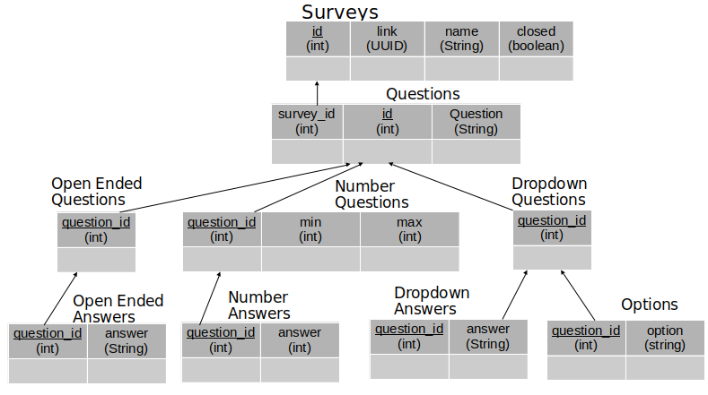

# SYSC4806_Project 
The SYSC4806_Project For Group 2

Question-Quail (Mini-SurveyMonkey)
==============

# Background
This project is a mini survey monkey application. It allows users to 
create and register surveys, and collect results from the surveys.

A surveyor can create a survey with a list of Questions. Questions can be open-ended (text), asking for a number within a range, or asking to choose among many options.  Users fill out a survey that is a form generated based on the type of questions in the survey. Surveyor can close the survey whenever they want (thus not letting in new users to fill out the survey), and at that point a survey result is generated, compiling the answers: for open-ended questions, the answers are just listed as-is, for number questions a histogram of the answers is generated, for choice questions a pie chart is generated.

# Installation Instructions
  1. Create a folder for the project to be located in.
  
  2. In your created folder, clone the repo from github using: 
  
    SSH: git clone git@github.com:MichaelDysart/SYSC4806_Project.git
    
    HTTPS: git clone https://github.com/MichaelDysart/SYSC4806_Project.git
    
  3. Open the cloned project folder in IntelliJ by running IntelliJ, clicking the "Open" button, and selecting the project          folder.
  
  4. Upon the project being opnened, ensure that you're workspace is using Maven and Java 8. IntelliJ should automatically prompt you to select your sdk and to import Maven.
  
  5. Click on the Maven tab on the right side of the page, and click on 
  SYSC4806_Project -> Lifecycle -> Package
  
  This will compile a build that is capable of being run.
  
  6. Now that the build is ready to be run, we can simply right click on the ServerWebContentApplication, and click Run->main.

# Schema and UML
Schema:

UML:

